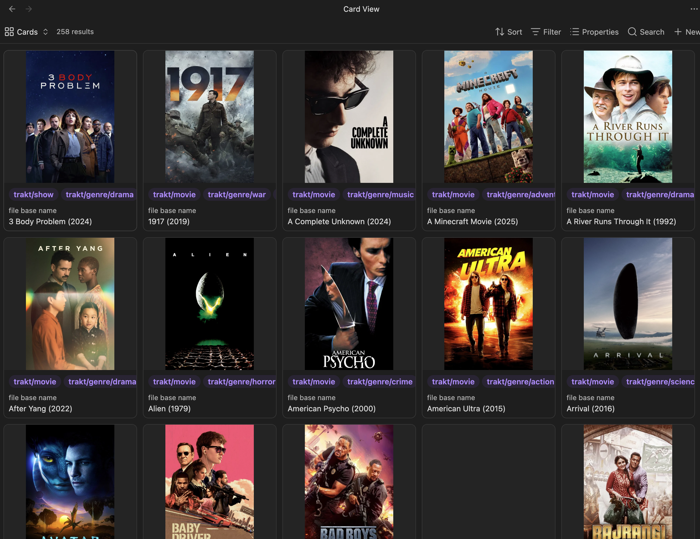
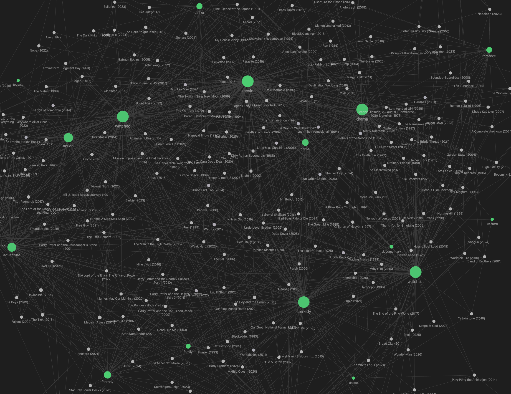
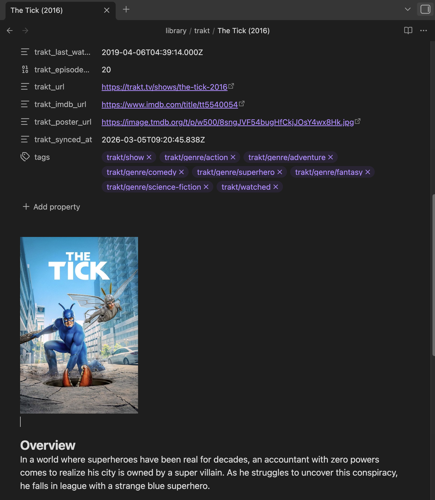

# Traksidian

Obsidian plugin to sync your Trakt.tv watchlist, watch history, favorites, and ratings.

## Features

- Creates one Markdown note per movie or TV show with frontmatter, a customizable body template, and optional tags
- Syncs from four sources: **watchlist**, **watch history**, **favorites**, and **ratings**
- Merges all sources into a single note per item. In other words, a watched, favorited, and rated movie produces one note
- Optional poster images via TMDB API
- Frontmatter-only updates preserve any of your own updates to a synced note's body
- Auto-sync on a configurable interval, and sync on startup
- Tag notes support (in case you don't want to use tags)

## Requirements

- A [Trakt.tv](https://trakt.tv) account and API application
- A [TMDB](https://themoviedb.org) API key for poster images (optional)

## Installation

**Community plugin directory:**

1. Open Obsidian → Settings → Community plugins → Browse
2. Search for "Traksidian" and install

**Manual installation:**

1. Download `main.js`, `manifest.json`, and `styles.css` from the [latest release](../../releases/latest)
2. Create `.obsidian/plugins/traksidian/` in your vault
3. Copy the three files into that folder
4. Enable the plugin in Settings → Community plugins

## Quick start

1. Go to [trakt.tv/oauth/applications](https://trakt.tv/oauth/applications) and create a new application with redirect URI `urn:ietf:wg:oauth:2.0:oob`
2. Copy the **Client ID** and **Client Secret** into Settings → Traksidian
3. Click **Connect to Trakt** and follow the device auth flow
4. Run the command **Traksidian: Sync watchlist**

For full configuration options, see the [User Manual](doc/MANUAL.md).

## Screenshots

## License

MIT
