# Traksidian — Developer Guide

A reference for understanding, debugging, and extending the plugin.

---

## Table of Contents

1. [Repository structure](#1-repository-structure)
2. [Build system](#2-build-system)
3. [Architecture overview](#3-architecture-overview)
4. [Plugin lifecycle](#4-plugin-lifecycle)
5. [Settings](#5-settings)
6. [Authentication](#6-authentication)
7. [Sync engine](#7-sync-engine)
8. [Note rendering](#8-note-rendering)
9. [Key data types](#9-key-data-types)
10. [Common tasks](#10-common-tasks)

---

## 1. Repository structure

```
obsidian-trakt-watchlist/
├── src/
│   ├── main.ts          # Plugin entry point and lifecycle
│   ├── settings.ts      # Settings interface, defaults, settings UI tab
│   ├── sync-engine.ts   # Core sync logic: fetch → merge → reconcile
│   ├── note-renderer.ts # Turns NormalizedItem into Markdown note content
│   ├── trakt-api.ts     # Trakt REST API calls
│   ├── trakt-auth.ts    # OAuth device-code flow + token refresh
│   ├── tmdb-api.ts      # TMDB poster image fetches
│   ├── types.ts         # All TypeScript interfaces
│   └── utils.ts         # sanitizeFilename, renderTemplate, toFrontmatter, parseFrontmatter
├── doc/
│   ├── MANUAL.md        # End-user manual
│   └── DEVELOPER.md     # This file
├── main.js              # Compiled output (checked in for Obsidian to load)
├── manifest.json        # Plugin metadata (id, name, version, minAppVersion)
├── styles.css           # Optional CSS loaded by Obsidian
├── esbuild.config.mjs   # Bundler config
├── tsconfig.json        # TypeScript config
└── package.json
```

### Why `main.js` is checked in

Obsidian loads `main.js` directly from the plugin folder. It is not fetched from npm. The compiled file must be committed so the plugin works when installed from GitHub releases.

---

## 2. Build system

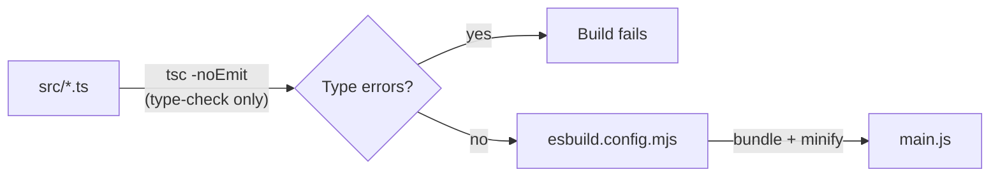

- **`npm run dev`** — runs esbuild in watch mode, no type checking, fast iteration
- **`npm run build`** — runs `tsc -noEmit` first (full type check), then esbuild in production mode

esbuild bundles everything into a single `main.js` with all `node_modules` inlined, except modules listed as `external` (the Obsidian API, Node built-ins, Electron). Those are provided at runtime by Obsidian itself.

---

## 3. Architecture overview

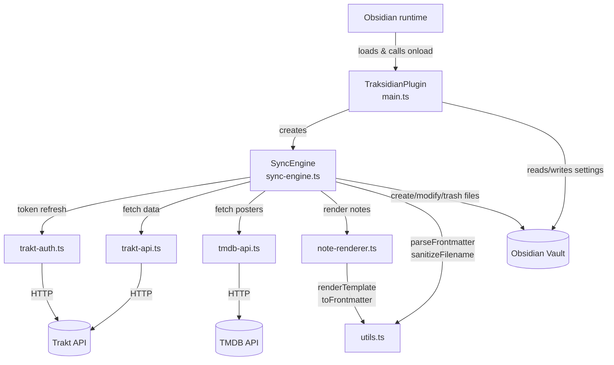

The plugin has no background server. Everything happens inside the Obsidian process when a sync is triggered.

---

## 4. Plugin lifecycle

### Startup sequence

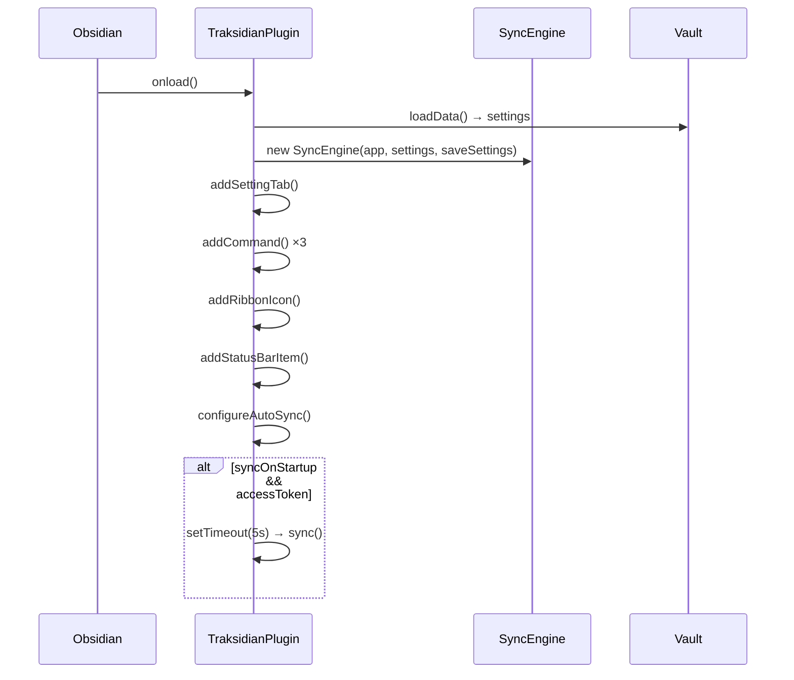

### Auto-sync reconfiguration

`configureAutoSync()` is called during `onload()` and again whenever the user changes auto-sync settings in the UI.

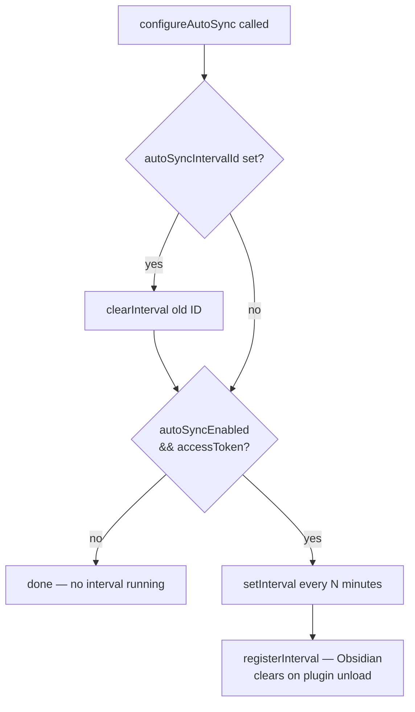

> **Note:** `autoSyncIntervalId` is kept as a field so `configureAutoSync` can clear the previous interval before creating a new one. `registerInterval` handles final cleanup on unload; there is no `onunload` override needed.

---

## 5. Settings

### Data flow

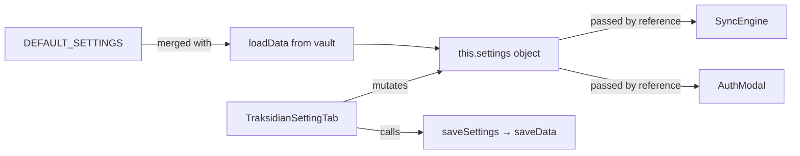

`this.settings` is passed by reference to `SyncEngine` and `AuthModal`. Both mutate it directly (e.g. writing new tokens after auth). This means `SyncEngine` always sees the latest settings without needing to be recreated.

### Interface at a glance (`src/settings.ts`)

| Group | Key fields |
|---|---|
| Auth | `clientId`, `clientSecret`, `accessToken`, `refreshToken`, `tokenExpiresAt` |
| TMDB | `tmdbApiKey`, `posterSize` |
| Vault | `propertyPrefix`, `folder`, `filenameTemplate` |
| Templates | `movieNoteTemplate`, `showNoteTemplate`, `tagPrefix` |
| Sources | `syncWatchlist`, `syncFavorites`, `syncWatched`, `syncRatings` |
| Behavior | `syncMovies`, `syncShows`, `autoSyncEnabled`, `autoSyncIntervalMinutes`, `syncOnStartup`, `overwriteExisting`, `deleteRemovedItems` |

`DEFAULT_SETTINGS` provides every field so `Object.assign({}, DEFAULT_SETTINGS, savedData)` always produces a complete object, even after adding new fields to the interface.

---

## 6. Authentication

Trakt uses the **OAuth 2.0 device code flow** — no redirect URI or browser callback needed. The user visits a URL and enters a short code; the plugin polls until authorized.

### Full auth flow

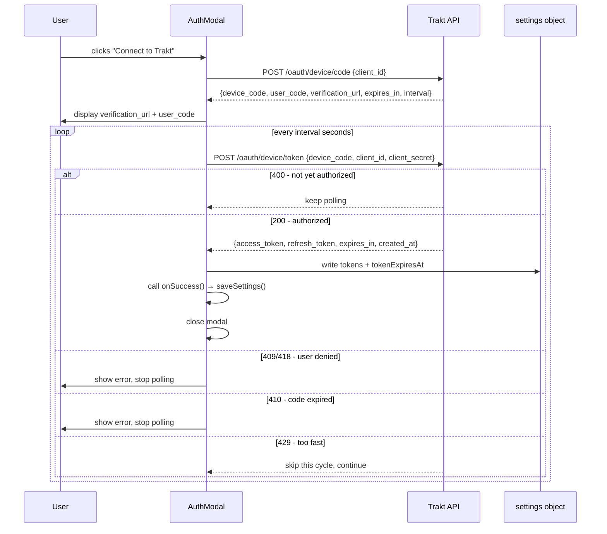

### Token refresh

`ensureValidToken()` in `trakt-auth.ts` is called at the start of every sync. It checks whether the access token expires within the next hour and refreshes it proactively.

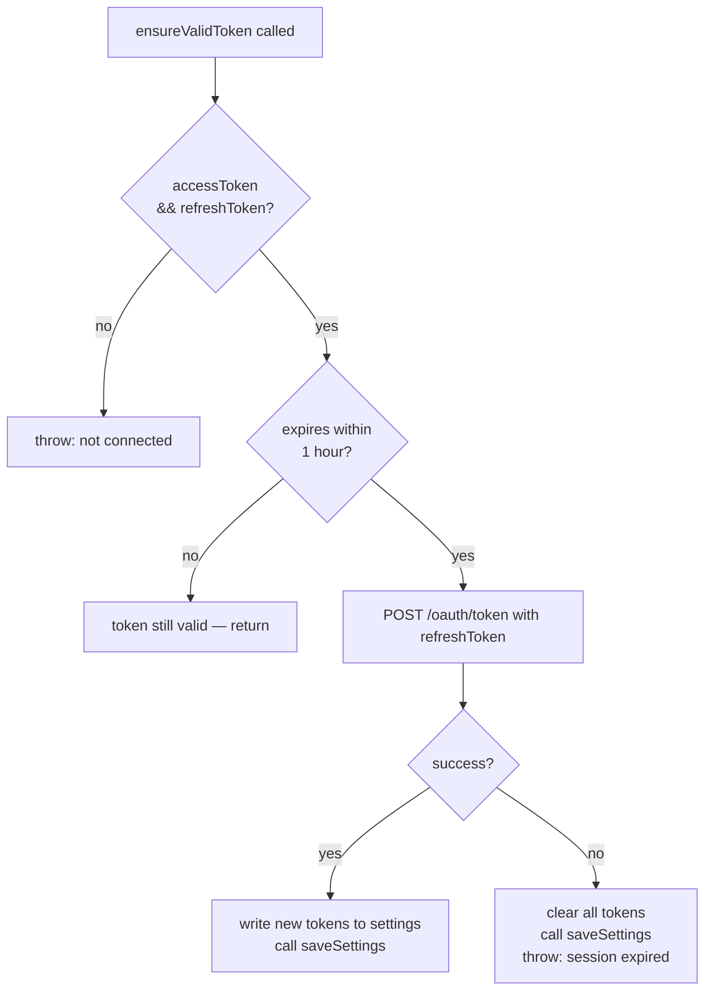

---

## 7. Sync engine

`SyncEngine.sync()` in `src/sync-engine.ts` is the core of the plugin. It runs in three phases: **fetch**, **merge**, **reconcile**.

### High-level flow

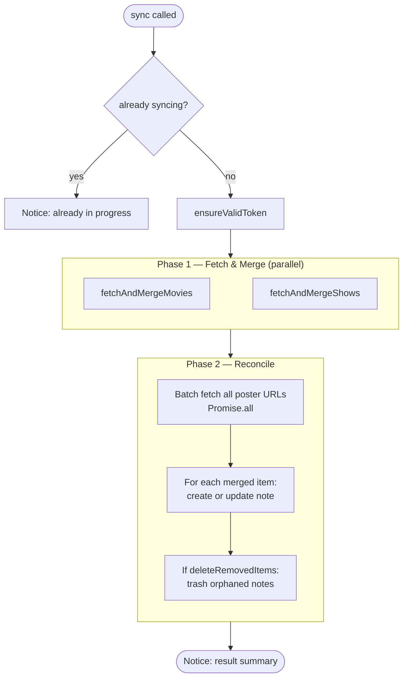

### fetchAndMergeMovies / fetchAndMergeShows

Both methods follow the same pattern. All four source API calls fire concurrently:

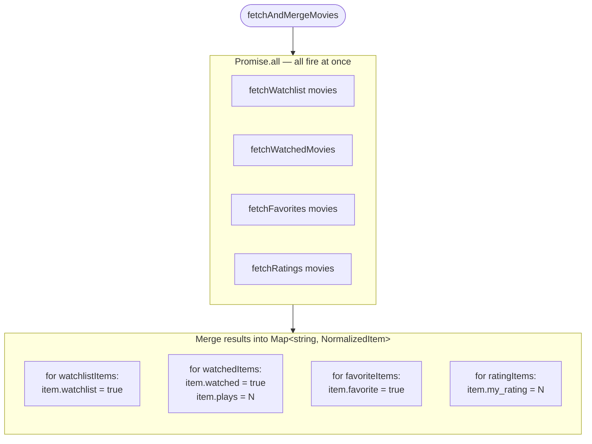

**`getOrCreateItem`** is the key deduplication function. If an item appears in multiple sources (e.g. both watchlist and watched), it gets a single `NormalizedItem` and the flags from each source are merged onto it:

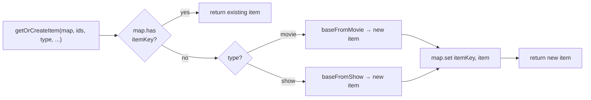

**Item key format:** `"movie:123"` or `"show:456"` — a composite of type + Trakt ID. This prevents collisions since Trakt assigns IDs independently per type (a movie and a show can share the same number).

### reconcileType — create/update/delete

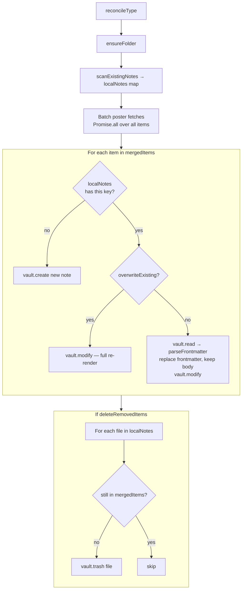

### scanExistingNotes

Reads the notes folder and builds a `Map<string, TFile>` keyed by the same `"type:id"` composite. This is how the engine knows which vault files correspond to which Trakt items.

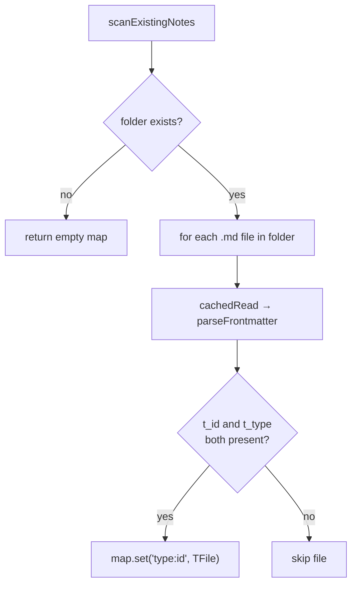

> **Why read `t_type` as well as `t_id`?** Trakt IDs are not globally unique across types. Movie #1 and Show #1 are different entities. The composite key ensures they never collide.

### Trakt API pagination

`fetchPaginated` in `trakt-api.ts` handles all paginated endpoints:

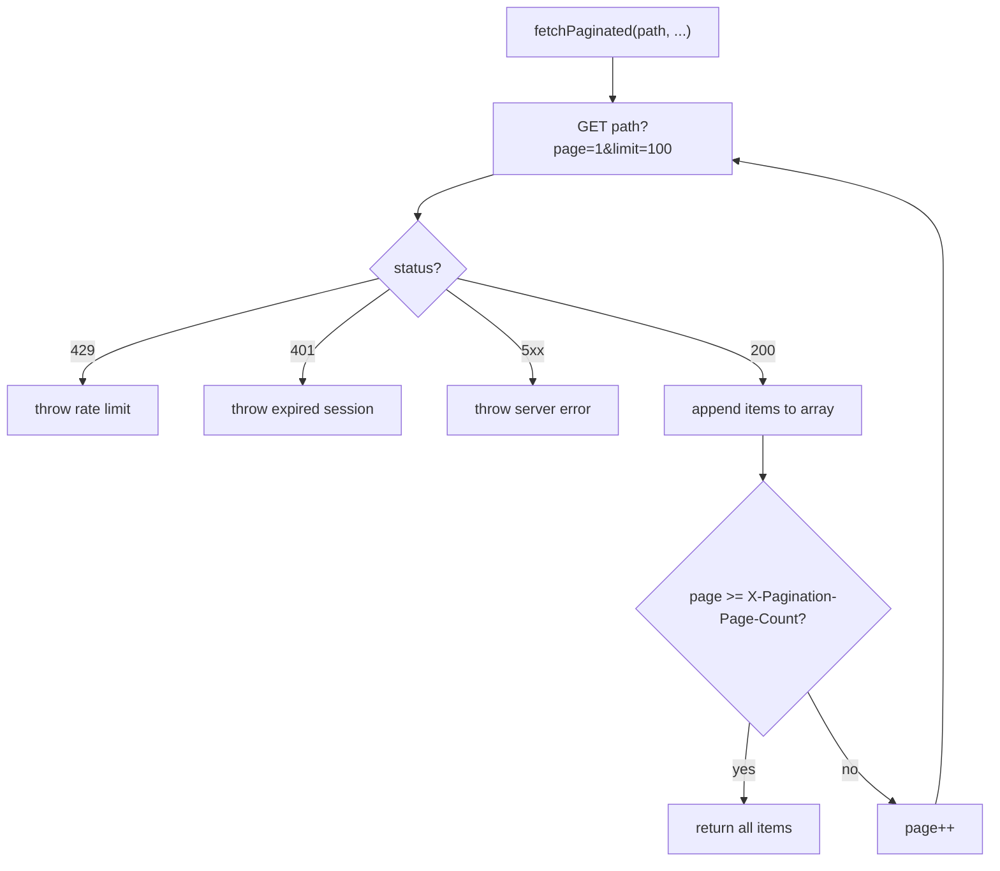

---

## 8. Note rendering

`src/note-renderer.ts` turns a `NormalizedItem` into Markdown.

### Full note render path

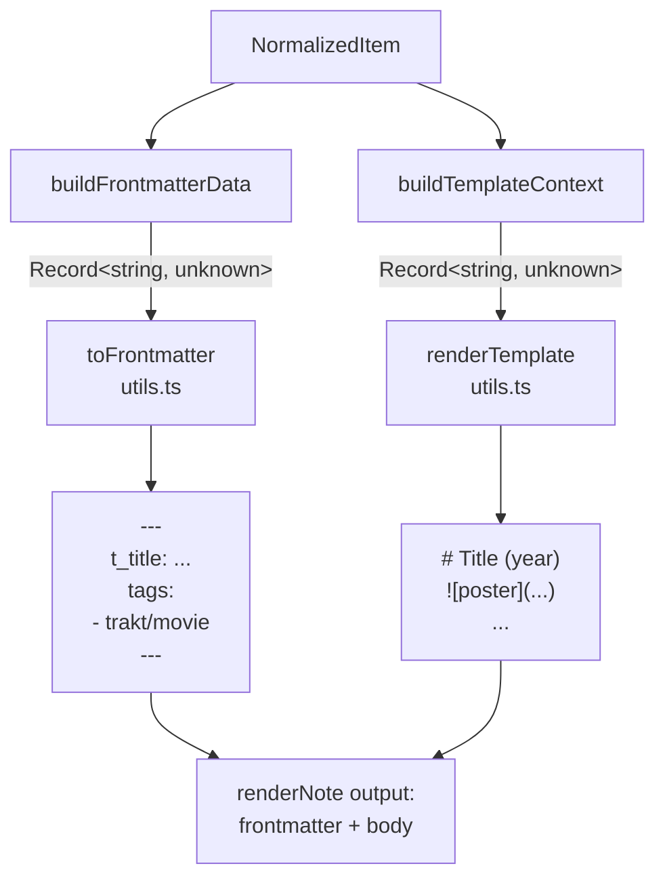

### Frontmatter-only update (overwriteExisting = false)

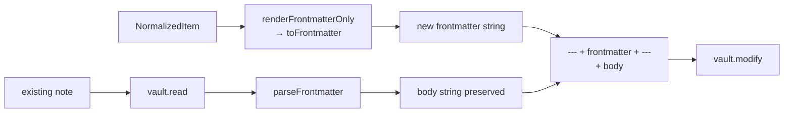

### Template variable resolution

`renderTemplate` in `utils.ts` does a simple regex replace of `{{varName}}` → value. Variables that are `null`/`undefined` become empty string. Arrays join with `", "`.

The same `{{variable}}` names are available whether you're using the movie template or the show template. Movie-specific variables (like `{{tagline}}`) are just empty in show notes, and vice versa.

---

## 9. Key data types

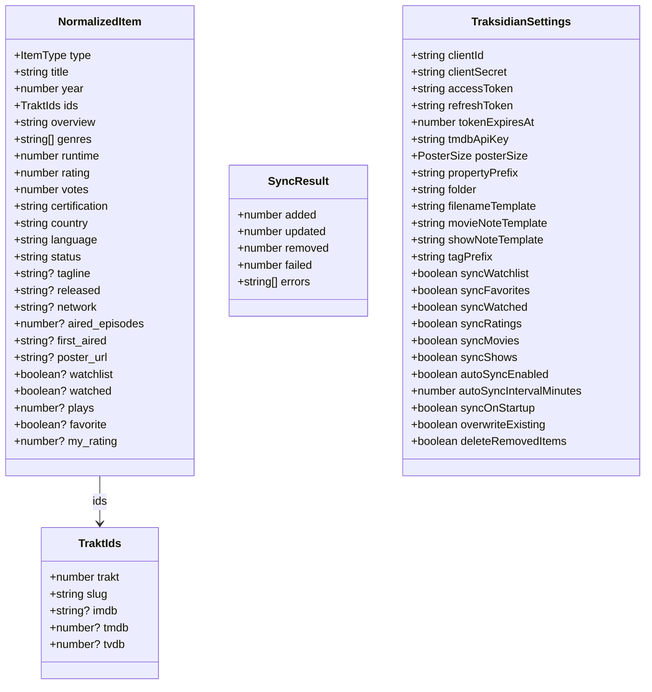

### Why `NormalizedItem` has optional source flags

`NormalizedItem` is built by `baseFromMovie` / `baseFromShow` with core metadata only. Source flags (`watchlist`, `watched`, `favorite`, `my_rating`) are then set conditionally during the merge phase. A movie that appears only in ratings will have `my_rating` set but `watchlist` undefined (not false — the distinction matters for `toFrontmatter`, which skips undefined/null fields).

---

## 10. Common tasks

### Add a new sync source

1. Add a `syncXxx: boolean` field to `TraksidianSettings` in `settings.ts` and to `DEFAULT_SETTINGS`
2. Add a toggle setting in `TraksidianSettingTab.display()`
3. Add a `fetchXxx(type, clientId, accessToken)` function in `trakt-api.ts` (reuse `fetchPaginated`)
4. Inside `fetchAndMergeMovies` / `fetchAndMergeShows` in `sync-engine.ts`, add the new fetch to the `Promise.all` array and a loop to merge the results into the map

### Add a new frontmatter field

1. Add the field to `NormalizedItem` in `types.ts` (optional `?:` if not always present)
2. Populate it in `baseFromMovie` or `baseFromShow`, or in the relevant merge loop
3. Add `data[${p}fieldname] = ...` in `buildFrontmatterData` in `note-renderer.ts`
4. Optionally add it to `buildTemplateContext` if you want a `{{variable}}` for templates

### Add a new template variable

1. Add an entry to the object returned by `buildTemplateContext` in `note-renderer.ts`
2. Document it in the user manual (`doc/MANUAL.md`)
3. That's it — `renderTemplate` picks it up automatically

### Change the note file-naming scheme

Edit `buildFilename` in `sync-engine.ts`. The function calls `renderTemplate` with a context of `{title, year, imdb_id, trakt_id}` and then `sanitizeFilename`. To add more variables, expand that context object.

### Debugging a sync

The sync result object (`SyncResult`) accumulates errors in `result.errors`. Individual item failures are caught and counted in `result.failed` rather than aborting the whole sync. To see all errors, open the developer console (`Cmd+Opt+I` on Mac) — errors are also printed there via the failure path in `reconcileType`.

The Trakt API returns paginated results with `X-Pagination-Page-Count` in the response header. If a user has a very large library, `fetchPaginated` will loop through all pages before returning.

### Token expiry edge case

If `ensureValidToken` throws (e.g. refresh token is also expired), the sync catches it at the top level and shows a Notice. The user will need to disconnect and reconnect via the settings tab. The tokens are cleared from settings automatically by `ensureValidToken` on refresh failure.
